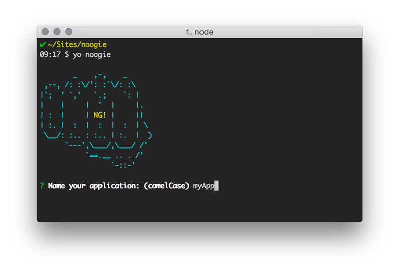

# NooGie - AngularJS Component Generator

Noogie is a [Yeoman](http://yeoman.io) generator that scaffolds out Angular apps using a component-based approach.



## Methodology & Fundamentals
[Noogie](http://noogie.io) was created to help developers build Angular 1.5+ applications using a component-based approach similar to [Angular 2.0](https://angular.io/) and other component-based frameworks.

Noogie doesn't have an option for using Angular 2.0 yet but it is on the immediate project road map. The project is new and the initial goal is to help developers build component-based applications with what's available today in Angular 1.5. 

The generator scaffolds applications based on the idea of "root" and "nested" components. Supporting details can be found in the [Noogie Blog](http://blog.noogie.io/). The project was insprired by the new Component API available in Angular 1.5 and the need to move towards component-based development. I also highly recommend [this article](http://teropa.info/blog/2015/10/18/refactoring-angular-apps-to-components.html) by [Tero Parviainen](https://twitter.com/teropa) which helped influence Noogie's design decisions.

Noogie scaffolds Angular components two ways, (1) using the new 1.5 Component API or also with (2) traditional Angular Directives. Think of these as "component bundles". Component bundles are generated with their own HTML, Sass, and Component / Directive/Controller files. Use of ng-controller and binding controllers to routes is not recommended, though there is a controller generator for any one-off controller needs.

Sample Component Bundle (as a Directive):
```
├── components/
│   ├── my-noogie-component
│   │   ├── my-noogie-component.html
│   │   ├── my-noogie-component.scss
│   │   ├── my-noogie-controller.js
│   │   ├── my-noogie-directive.js
```
Sample Component Bundle (as an Anguar 1.5 Component):
```
├── components/
│   ├── my-noogie-component
│   │   ├── my-noogie-component.html
│   │   ├── my-noogie-component.scss
│   │   ├── my-noogie-component-component.js
```

## Installation & Getting Started

- Install dependencies: `npm install --global yo gulp bower`
- Install the generator: `npm install --global generator-noogie`
- Run `yo noogie` to scaffold your webapp
- Run `gulp serve` to preview and watch for changes
- Run `bower install --save <package>` to install frontend dependencies
- Run `gulp` to build your webapp for production * This is currently not working completely
- Run `gulp serve:dist` to preview the production build * This is currently not working completely

## Available Generators
- `yo noogie:directive` Builds a Directive Component bundle
- `yo noogie:component` Builds an Angular 1.5 Component bundle
- `yo noogie:controller` Builds an Angular controller should you need one separately from a component bundle
- `yo noogie:factory` Builds an Angular factory (services and providers coming soon)

## Features
- Newly genereated component bundle files are auto-injected into the index.html
- Component Sass partials are auto-imported into a main.scss
- Includes Sass and Bootstrap
- It's called Noogie. What's not to love about that?

## Coming Soon...
- Angular 2.0 inclusion 
- An option to specify root or nested components
- Dynamic module loading (currently, all JS is included in the app)
- ES2015 style components & modules
- A prettier start screen following initial generator usage

## Contribute
Contributors are welcome. Please use the dev branch and fork/submit pull requests. Approved PR's will be merged into master on a forthcoming release cadence. 

Feel free to contact me directly with questions or feedback or to say hello [@chrisjordanme](http://twitter.com/chrisjordanme)

## License
[BSD license](http://opensource.org/licenses/bsd-license.php)
